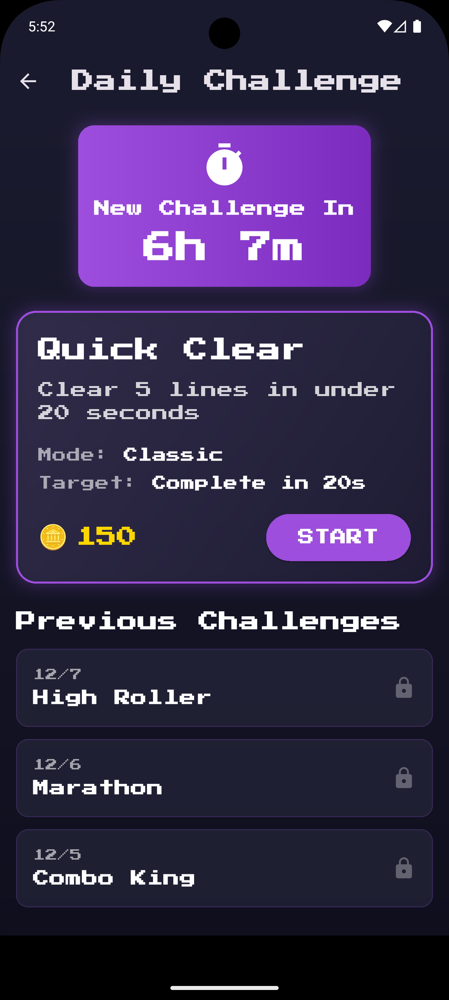

# Blockerino V2

A modern Block Blast-style puzzle game built with Flutter, featuring Firebase backend integration, multiple game modes, and comprehensive analytics.

## Screenshots

<div align="center">
  
  
  
  
</div>

## Game Features

- **Three Game Modes**:
  - **Classic Mode**: 8x8 grid with 3 pieces - endless gameplay
  - **Chaos Mode**: 10x10 grid with 5 pieces - fast-paced action
  - **Story Mode**: 20 progressive levels with star ratings and target scores
- **Core Gameplay**:
  - Drag and drop piece placement with visual preview
  - Line clearing mechanics (horizontal and vertical)
  - Combo system with multipliers
  - Real-time score tracking
  - Haptic feedback and sound effects
  - Smooth animations and particle effects
  - Intelligent game over detection
- **Progression System**:
  - Story mode with 20 unique levels
  - Star rating system (1-3 stars per level)
  - Level-specific target scores and challenges
  - Unlockable content and achievements
- **Online Features**:
  - Firebase Authentication (Anonymous + Google Sign-In)
  - Real-time leaderboard with Firestore
  - Cloud save synchronization
  - Comprehensive analytics tracking
  - Crash reporting and performance monitoring

## Project Structure

```
lib/
├── main.dart                      # App entry point with Firebase initialization
├── models/
│   ├── piece.dart                 # Piece data structure and 19-piece library
│   ├── board.dart                 # Board logic and block management
│   ├── game_mode.dart             # Game mode configurations
│   ├── story_level.dart           # Story mode level definitions (20 levels)
│   └── leaderboard_entry.dart     # Leaderboard data model
├── cubits/                        # BLoC (Cubit) state management
│   ├── game/
│   │   ├── game_cubit.dart        # Game logic cubit with Firebase sync
│   │   └── game_state.dart        # Game state classes (Initial, InProgress, Over)
│   └── settings/
│       ├── settings_cubit.dart    # Settings cubit with Firestore persistence
│       └── settings_state.dart    # Settings state with Equatable
├── services/
│   ├── auth_service.dart          # Firebase Authentication (Anonymous + Google)
│   ├── firestore_service.dart     # Cloud Firestore operations
│   ├── analytics_service.dart     # Firebase Analytics tracking
│   ├── crashlytics_service.dart   # Crash reporting
│   └── remote_config_service.dart # Remote configuration
├── screens/
│   ├── main_menu_screen.dart      # Main menu with profile section
│   ├── game_screen.dart           # Game play screen with story mode support
│   ├── store_screen.dart          # In-app purchases (placeholder)
│   ├── leaderboard_screen.dart    # Real-time global leaderboard
│   └── story_mode_screen.dart     # Story level selection
└── widgets/
    ├── board_grid_widget.dart     # Game board with responsive sizing
    ├── hand_pieces_widget.dart    # Player's piece inventory with preview
    ├── game_hud_widget.dart       # Score, combo, and stats display
    ├── draggable_piece_widget.dart # Draggable pieces with grid snapping
    └── google_sign_in_dialog.dart  # Authentication UI
```

## Installation

### Prerequisites

- Flutter SDK (>=3.2.0)
- Dart SDK (>=3.0.0)
- Firebase project with the following services enabled:
  - Authentication (Anonymous + Google Sign-In)
  - Cloud Firestore
  - Firebase Analytics
  - Firebase Crashlytics
  - Firebase Performance Monitoring
- Android Studio / Xcode for mobile development
- iOS Simulator / Android Emulator / Physical Device

### Setup

1. **Navigate to the project directory**:
```bash
cd blockerino
```

2. **Install dependencies**:
```bash
flutter pub get
```

3. **Firebase Configuration**:
   - Place `google-services.json` in `android/app/`
   - Place `GoogleService-Info.plist` in `ios/Runner/`
   - Enable Anonymous Authentication in Firebase Console
   - Configure Google Sign-In in Firebase Console

4. **Run the app**:
```bash
# Check available devices
flutter devices

# iOS
flutter run -d ios

# Android
flutter run -d android

# Specific emulator
flutter run -d emulator-5554
```

5. **Build release APK**:
```bash
flutter build apk --release
# Output: build/app/outputs/flutter-apk/app-release.apk
```

## Key Components

### Models

- **Piece**: 19 unique block shapes with colors and rotation support
- **Board**: Game grid management, piece placement validation, and line clearing
- **GameMode**: Classic (8x8, 3 pieces) and Chaos (10x10, 5 pieces) configurations
- **StoryLevel**: 20 progressive levels with difficulty scaling and star thresholds
- **LeaderboardEntry**: Player rankings with scores, timestamps, and game modes

### State Management

- **BLoC (Cubit) pattern** for reactive state management with immutable states
- **GameCubit**: 
  - Game logic, score, combo, and piece placement
  - Separate states: GameInitial, GameInProgress, GameOver, GameLoading
  - Firebase sync for scores and achievements
  - Story mode progression tracking
  - Per-mode saved games with SharedPreferences persistence
- **SettingsCubit**: 
  - User preferences (sound, haptics, animations, volume)
  - Immutable state with Equatable for performance
  - Persistent storage with Firestore and SQLite
  - Anonymous authentication on first launch

### Game Logic

- **Piece Placement**: 
  - Validates piece fits on board
  - Visual preview shows valid/invalid placement
  - Snaps to grid with haptic feedback
- **Line Breaking**: 
  - Detects complete rows and columns simultaneously
  - Clears lines with animation effects
  - Awards combo bonuses for multiple clears
- **Scoring System**:
  - Base points for placing blocks (1 pt per block)
  - Line clear bonus (10 pts per line)
  - Combo multiplier (2x, 3x, 4x for consecutive clears)
  - Story mode star ratings based on target scores
- **Game Over**: 
  - Checks all remaining pieces against all board positions
  - Detects when no valid placement exists
  - Story mode: level completion vs game over

### Firebase Integration

- **Authentication**:
  - Anonymous sign-in on first launch
  - Google Sign-In with profile display
  - Persistent user IDs across sessions
- **Firestore**:
  - Real-time leaderboard streams
  - Cloud save for coins and settings
  - Automatic synchronization
- **Analytics**:
  - Screen view tracking (all screens)
  - Event tracking (game start, piece placed, lines cleared, game over)
  - User properties (game mode, score, level)
- **Crashlytics**: Automatic crash reporting and error logging
- **Performance**: Monitors app startup and screen load times

### UI/UX

- **Drag and Drop**: 
  - Native Flutter Draggable/DragTarget widgets
  - Real-time placement preview on board
  - Visual feedback for valid/invalid positions
- **Haptic Feedback**: 
  - Light impact on piece pickup
  - Medium impact on successful placement
  - Heavy impact on line clears and game over
- **Animations**: 
  - Smooth piece scaling and opacity transitions
  - Line clear effects with particle explosions
  - Combo multiplier pop-up animations
- **Responsive Design**: 
  - Adapts to different screen sizes and aspect ratios
  - FittedBox scaling for piece previews
  - Flexible layouts for portrait/landscape

## Known Issues & Fixes

### Recent Bug Fixes
1. **RenderFlex Overflow**: Fixed piece preview overflow by wrapping in `FittedBox` for automatic scaling
2. **Story Mode Dialog**: Removed confusing "GAME OVER" text when level is successfully completed
3. **Score Reset**: Fixed score carrying over between story levels by calling `resetGame()` before navigation
4. **Level Progression**: Added "NEXT LEVEL" button with proper navigation flow using `pushReplacement`

### Configuration Requirements
- **Critical**: Enable Anonymous Authentication in Firebase Console before first run
- **Optional**: Configure Google Sign-In OAuth credentials for full authentication features

### Manual Testing Checklist
- [ ] Classic mode gameplay (piece placement, line clearing, scoring)
- [ ] Chaos mode gameplay (5 pieces, 10x10 grid)
- [ ] Story mode progression (complete levels, earn stars, advance to next level)
- [ ] Authentication (auto sign-in, Google Sign-In, sign-out)
- [ ] Leaderboard (view scores, real-time updates)
- [ ] Settings (sound toggle, haptic toggle, volume slider)
- [ ] Profile (display name, sign-in status)
- [ ] Analytics events (check Firebase Console)

### Build Testing
```bash
# Debug build
flutter run --debug

# Release build
flutter build apk --release

# Install on device
adb install build/app/outputs/flutter-apk/app-release.apk
```
